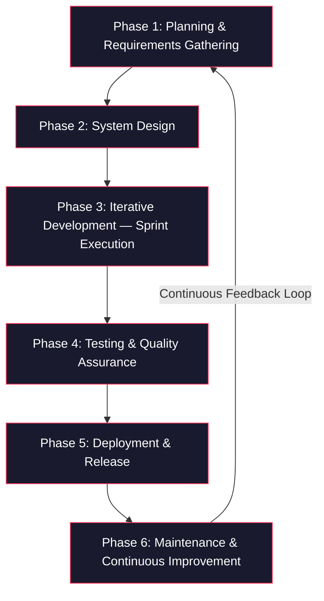

# Software Development Life Cycle (SDLC)

## NailssentialsQC — Nail Salon Quality Control and Management System

**Methodology:** Agile (Iterative & Incremental Development)
**Project Duration:** April 30 – May 15, 2026
**Technology Stack:** React 19, Express.js, TypeScript, PostgreSQL, Prisma ORM, Vercel

---

## 1. Introduction

This section presents the Software Development Life Cycle (SDLC) adopted for the development of the NailssentialsQC system. The project followed the Agile methodology, which emphasizes iterative development, continuous stakeholder feedback, and incremental delivery of functional software. The Agile approach was selected due to the project's evolving requirements and compressed timeline, enabling the team to deliver working software in short cycles while adapting to emerging requirements across three milestone releases.

The following diagram illustrates the overall SDLC process adopted throughout the project:

As shown in the diagram, the SDLC follows a six-phase cycle where Phase 6 (Maintenance) feeds back into Phase 1 (Planning), reflecting the Agile principle of continuous improvement. Each phase was executed iteratively across three milestones: v1.0 (MVP), v2.0 (Premium Experience & Expansion), and v2.1 (Advanced Payroll & Export System).

---

## 2. Phase 1: Planning and Requirements Gathering

The planning phase established the foundational scope, objectives, and constraints of the NailssentialsQC system. The project aimed to address the operational needs of a nail salon in Quezon City by replacing manual processes for appointment booking, staff attendance tracking, commission computation, and payroll management with a unified web-based system.

Three user roles were identified as primary stakeholders: **Customers**, who require online booking and appointment management capabilities; **Staff**, who need attendance tracking, commission visibility, and payslip access; and **Managers**, who require payroll administration, analytics, staff onboarding, and content management tools.

Functional requirements were gathered and documented using unique identifiers for traceability. These requirements were organized across milestones to facilitate incremental delivery. For the initial milestone (v1.0), requirements included user authentication with JWT tokens, role-based access control, appointment booking with service selection, staff clock-in/clock-out functionality, and commission calculation upon appointment completion. The second milestone (v2.0) introduced requirements for dashboard redesign, animated transitions, a public gallery with content management, advanced analytics, and service package bundling. The third milestone (v2.1) addressed payroll computation, categorized deduction management, PDF payslip generation, and Excel master report export.

Non-functional requirements and constraints were also identified during this phase. The project mandated the use of the existing technology stack (React 19, Express.js, Prisma, PostgreSQL) without framework migrations. Backward compatibility was enforced to ensure that new features would not disrupt existing functionality for any user role. Test coverage targets were set at 80% for the backend, 70% for the frontend, and 90% for critical paths such as authentication and payroll. Deployment was constrained to Vercel for production hosting and Docker Compose for the local development environment.

Features deemed outside the project scope were explicitly documented to prevent scope creep. These included payment gateway integration (as the salon processes payments offline), real-time chat functionality, multi-tenant or multi-location support, and multi-staff package scheduling due to its excessive complexity.

---

## 3. Phase 2: System Design

The system design phase translated the gathered requirements into technical architecture decisions covering the database layer, API structure, user interface design system, and overall project organization.

**Database Design.** A relational database schema was designed using PostgreSQL through the Prisma ORM, consisting of over 20 interconnected models. The schema was structured around the core business entities: Users (with a Role enum distinguishing customers, staff, and managers), CustomerProfiles, StaffProfiles, Services organized by ServiceCategories, Appointments containing multiple AppointmentItems, Transactions, and Commissions. For financial accuracy, all monetary fields utilized the Decimal type with 10-digit precision and 2 decimal places. Composite database indexes were applied on frequently queried field combinations such as staff_id with date, and appointment_date with status, to optimize query performance. The payroll domain introduced PayrollPeriod, StaffPayroll, StaffPayrollItem, DeductionLog, and a salary structure pattern (SalaryComponent, SalaryStructure, SalaryStructureAssignment) to support flexible and configurable compensation logic.

**API Architecture.** The backend was designed as a RESTful API built with Express.js and TypeScript. Endpoints were organized into logical groups: authentication (registration, login, token refresh with rotation), service and appointment management (CRUD operations), payroll generation and management, and analytics aggregation (revenue, staff performance, customer retention). Role-based middleware was implemented to protect routes, ensuring that only authorized user roles could access their respective endpoints.

**UI/UX Design System.** A premium design system was established to differentiate the application's visual identity. The primary brand color adopted was Rausch (#FF385C), inspired by contemporary design trends, paired with an organic border-radius system using 32px for containers, 12px for utility elements, and 8px for data-dense components. Typography employed Playfair Display for hero sections and Inter for body text. Motion design was implemented through framer-motion, providing page transitions (PageTransition component) and interactive card animations (AnimatedCard component). The component library was built upon Radix UI and shadcn primitives with Tailwind CSS for styling.

**Project Structure.** The codebase was organized as a monorepo with clearly separated frontend and backend directories. The frontend utilized React 19 with Vite as the build tool, while the backend ran Express.js with TypeScript compilation. The shared Prisma schema resided at the project root, and Docker Compose was configured for local development database provisioning.

---

## 4. Phase 3: Iterative Development (Sprint Execution)

Development followed the Agile sprint model, where each sprint produced a working, testable increment of the system. The project was executed across four sprints, each aligned to a specific milestone or milestone wave.

**Sprint 1 (May 1–4, 2026) — v1.0 MVP Core and Stabilization.** The first sprint focused on establishing a stable and functional baseline. Work was organized into parallel tracks addressing critical bug fixes (JSX rendering errors, hardcoded credentials, type mismatches, and schedule upsert logic), a type safety overhaul (eliminating all TypeScript `any` types and decomposing monolithic components), security hardening (JWT fail-fast validation, password strength enforcement, RBAC middleware, API rate limiting, and refresh token rotation), performance optimization (parallel database queries with Promise.all, batched service lookups, database indexing, and Prisma transaction batching), implementation of missing features (audit trail logging, data export, configurable sales targets), and establishment of the test infrastructure using Jest with Supertest for the backend and Vitest with React Testing Library for the frontend. This sprint completed 7 phases with 34 plans, culminating in the v1.0 release on May 4, 2026.

**Sprint 2 (May 4–6, 2026) — v2.0 Wave 1: Premium UI and Customer Experience.** The second sprint established the premium visual identity and redesigned the public-facing customer experience. Deliverables included the global design token system (Rausch palette, organic radii, and motion primitives), the customer journey redesign featuring a photography-first hero section with Playfair Display typography and a trending treatments grid, the nail art exhibit gallery with Vercel Blob storage integration and masonry layout, and the operations interface overhaul introducing a categorized manager sidebar and mobile-responsive staff dashboard with attendance tracking cards. This sprint completed 4 phases with 16 plans, though 3 plans from the customer journey phase were strategically deferred when priorities shifted toward business-critical features.

**Sprint 3 (May 6–10, 2026) — v2.0 Wave 2: Business Features and Analytics.** The third sprint delivered features to empower business operations. The marketing CMS provided full CRUD functionality for landing page content (hero text, contact information, policies, and FAQ) with React Query caching at a 10-minute stale interval. The service packages and bundling feature enabled managers to create fixed service bundles through a PackageBuilderDialog, customers to add packages to their cart via a CartPackageItem component, and the commission engine to preserve catalog prices for fair compensation while billing the discounted package price. The advanced analytics dashboard introduced revenue visualization (stacked bar and line charts), a staff performance leaderboard with tiered badges (gold, silver, bronze), and retention analytics with a 60-day repeat rate metric and donut chart visualization. This sprint completed 3 phases with 13 plans, and v2.0 was released on May 10, 2026.

**Sprint 4 (May 10–15, 2026, ongoing) — v2.1: Payroll Engine and Advanced Features.** The fourth sprint addressed the advanced payroll computation system. Completed work included the database schema extension for categorized deductions (Cash Advance, Loan, Uniform, Reloan, Lates/Early Out), weekly payroll period management, and dynamic commission rate configuration. The weekly calculation engine was built to aggregate daily staff performance, compute gross pay with tiered commission rates (8% and 20% based on performance thresholds), subtract categorized deductions, and yield net pay. Work in progress includes the manager payroll UI for dashboard-based payroll review and the Excel master export matching the salon's existing spreadsheet format. Staff payslip PDF generation remains planned for subsequent completion.

---

## 5. Phase 4: Testing and Quality Assurance

Testing was integrated throughout the development process rather than treated as a discrete phase following development completion, consistent with Agile practices.

**Unit Testing.** The backend test suite was built using Jest with Supertest, targeting controller logic, middleware behavior, and API response validation. The frontend test suite employed Vitest with React Testing Library to verify component rendering and user interaction flows. The test infrastructure was established during Sprint 1 (v1.0) and extended in subsequent sprints as new features were introduced.

**Integration Testing.** API endpoints were validated through Supertest against the live Express application instance. Database operations were tested through the Prisma client connected to the PostgreSQL database. End-to-end authentication flows (registration, login, token refresh, and protected route access) were verified as integrated sequences. Payroll calculation accuracy was validated by comparing system-generated results against manually computed spreadsheet values to ensure financial correctness.

**User Acceptance Testing (UAT).** Structured UAT was conducted at each phase boundary before milestone release. Each phase defined explicit success criteria, and verification was performed against these criteria. Notable UAT results include: the gallery phase (Phase 3) passed all 4 acceptance criteria covering upload, display, layout, and modal functionality; the CMS phase (Phase 5) passed all 8 criteria covering CRUD operations, caching behavior, and public page rendering; the analytics phase (Phase 7) passed all 8 criteria covering chart rendering, leaderboard logic, and retention metric accuracy; and the payroll backend phase (Phase 8) passed all 4 criteria covering schema validation, API endpoint behavior, and period management.

**Build Verification.** TypeScript strict-mode compilation was verified after every sprint to prevent type regression. The Vite production build was validated for the frontend, and backend type-checking was performed through the TypeScript compiler. Multiple stabilization sessions were conducted, including the resolution of 53 frontend TypeScript errors and 26 backend TypeScript errors during the v1.0 sprint.

**Security Testing.** Security verification covered JWT token validation edge cases, rate limiting effectiveness on authentication endpoints, RBAC middleware enforcement for all protected routes, and input validation through Zod schemas on payroll-related endpoints.

---

## 6. Phase 5: Deployment and Release

Deployment activities ensured that developed features were reliably delivered to production while maintaining environment parity between development and production configurations.

**Development Environment.** The local development environment utilized Docker Compose for PostgreSQL database provisioning. Frontend and backend development servers ran concurrently using Vite (port 5173) and Express (port 5000), respectively. Prisma Studio provided a visual database inspection interface during development.

**Production Infrastructure.** The frontend was deployed to Vercel with automatic builds triggered by Git pushes. The backend was deployed as Vercel serverless functions. The production database was hosted on Neon PostgreSQL, a cloud-managed service. File storage was distributed between Vercel Blob (for the exhibit gallery images) and Cloudinary (for user profile pictures). Authentication in production was managed through Clerk, providing a managed auth service with role-based metadata.

**Database Migrations.** Schema evolution across milestones was managed through Prisma Migrate, ensuring consistent and reversible database changes. A notable migration during the project was the upgrade from Prisma 6 to Prisma 7 for Vercel deployment compatibility. All schema changes were versioned and tracked through Git.

**Release Management.** Three milestone releases were produced during the project period. Version 1.0 (MVP) shipped on May 4, 2026, delivering core booking, authentication, payroll foundations, and staff management. Version 2.0 (Premium Experience & Expansion) shipped on May 10, 2026, delivering the premium UI design system, gallery, CMS, analytics dashboard, and service packages. Version 2.1 (Advanced Payroll & Export System) is currently in progress, targeting advanced payroll computation, Excel export, and PDF payslip generation. A repository migration to a new Git repository (NailssentialsQC) was executed on May 7, 2026, maintaining clean commit history with descriptive conventions.

---

## 7. Phase 6: Maintenance and Continuous Improvement

Following each release, the maintenance phase addressed defects, incorporated user feedback, and refined the development process through retrospective analysis.

**Rapid Response Task System.** A quick task system was implemented to capture and resolve emerging issues without disrupting active sprint execution. Over 40 quick tasks were executed across the project, categorized into bug fixes (TypeScript compilation errors, JSX rendering issues, data format mismatches), UI refinements (navbar restructuring, sidebar categorization, service category updates), infrastructure maintenance (database URL configuration, API key synchronization, deployment error resolution), feature adjustments (login shortcuts, manager dashboard redirects, attendance card enhancements), and authentication improvements (Clerk integration, automatic role assignment, staff-only filtering for booking).

**Retrospective Analysis.** Formal retrospectives were conducted after each milestone to extract lessons and improve subsequent sprint execution. The v1.0 retrospective identified that parallel work tracks (addressing bugs, technical debt, security, and tests simultaneously) were effective at maintaining development momentum, and that the quick task system was valuable for capturing small work items without derailing phase-level execution. The v2.0 retrospective revealed that phase planning should reflect actual development capacity to avoid creating plans that will not be executed, that cross-phase dependencies require explicit "blocked by" status tracking rather than informal notes, that requirements documentation should be updated in real-time as work completes rather than deferred to milestone close, and that scope gaps should be flagged and deferred early when they become apparent.

**Technical Debt Tracking.** Identified technical debt was formally documented and tracked for future resolution. Outstanding items include the incomplete booking flow redesign (3 deferred plans from v2.0 Phase 2, scheduled for v2.2), the partial adoption of Zod for input validation alongside the legacy express-validator library, and test coverage that has not yet reached the target thresholds despite the infrastructure being in place.

**Process Evolution.** The development process evolved across milestones. Version 1.0 introduced parallel fix tracks for simultaneous multi-concern development. Version 2.0 adopted phase wave execution (Foundation → Core → Integration) as the standard planning structure. Version 2.1 formalized the discuss-plan-execute-verify pipeline for each development phase, systematizing the workflow into repeatable stages with documented context, research, validation, and review at each transition.

---

## 8. Summary

The development of the NailssentialsQC system demonstrated the practical application of the Agile SDLC methodology in delivering a full-featured salon management platform. Through four sprints spanning three milestone releases, the project progressed from a stabilized MVP to a premium application with advanced payroll computation, analytics dashboards, content management, and service bundling capabilities. The iterative approach enabled continuous adaptation to evolving requirements, with deferred scope handled through explicit backlog management rather than project disruption. Structured testing at each phase boundary, formal retrospectives after each milestone, and a rapid-response quick task system ensured sustained quality and process improvement throughout the development lifecycle.
